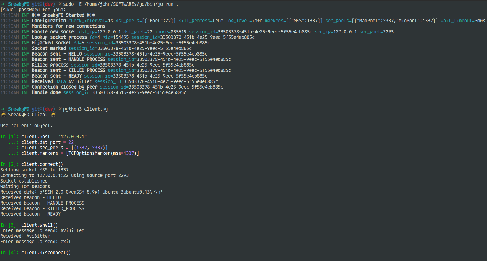

# 🥷 SneakyFD 🥷

I had a vision to develop a stealth front-connect backdoor that doesn't listen at all.

Servers have many processes and services that already listen - Let's use them!

**SneakyFD** hijacks established connection sockets from other listening processes.

> **⚠ WIP & POC**


## General Flow

- Monitor `/proc/net/tcp` for new established connections
    - matched by destination port and source port range
- Hijack the target socket from the socket owner process
    - only duplicates the socket, don't send&recv anything
    - by syscall `pidfd_getfd` (Linux 5.6+)
- Check if the connection is marked (is this really our connection?)
    - connection marked by TCP options (currently MSS supported)
    - by syscall `getsockopt`

At this point we start sending beacons to the client with current state - we're sure this is our connection.

- Socket exclusivity
    - to avoid races on recv from the socket, we want to get rid of the socket owner process
    - By killing the socket owner process (for example `sshd` forks each new connection)
    - By waiting until the socket timed out by the socket owner process

## Demo



## Configuration

configuraion file [config/config.go](config/config.go)

| Config | Type | Description | Default Value |
|-|-|-|-|
| LogLevel | `zerolog.Level` | logger level | `zerolog.InfoLevel` |
| DstPorts | `types.Ports` | list of destination ports to match | `types.Ports{types.FixedPort{Port: 22}}` |
| SrcPorts | `types.Ports` | list of source ports to match | `types.Ports{types.RangePort{MinPort: 1337, MaxPort: 2337}}` |
| CheckInterval | `time.Duration` | interval of monitoring new established connection sockets | `1 * time.Second` |
| Markers | `marker.Markers` | list of unique connection validators (aka markers) | `marker.Markers{marker.TCPOptionsMarker{MSS: 1337}}` |
| KillProcess | `bool` | kill the socket owner process or wait until the socket timed out by the socket owner process | `true` |
| WaitProcessTimeout | `time.Duration` | timeout for waiting until the socket timed out by the socket owner process | `3 * time.Minute` |
| BeaconMagic | `[]byte` | magic bytes for beacons messages | `[]byte{0xDE, 0xAD, 0xBE, 0xEF}` |

#### Client Example

```python
client.host = "127.0.0.1"
client.dst_port = 22
client.src_ports = [(1337, 2337)]
client.markers = [TCPOptionsMarker(mss=1337)]
```

## TODO

- fix wait process to wait until socket timed out
- real payloads (currently `EchoServer` for testing)
- support tcp6 (mapped addresses as well)
- encryption
- sessions managment
- communication covers
- make the code cleaner & error handling well
- ...
- ..
- .